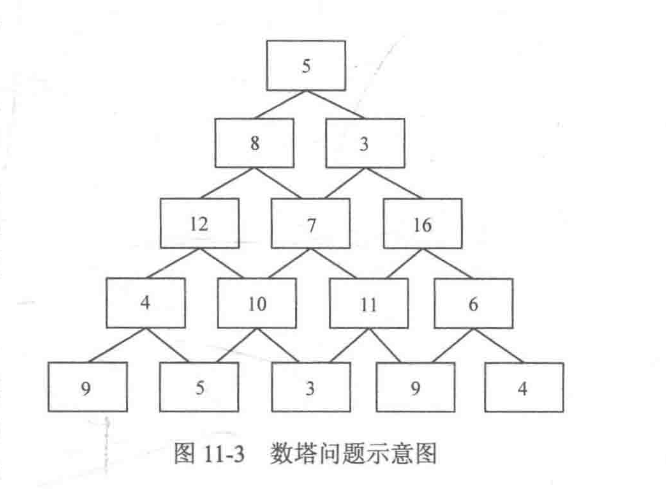

## 动态规划的递归写法和递推写法
动态规划是一种非常精妙的算法思想，它没有固定的写法、极其灵活，常常需要具体问题具体分析。和之前介绍的大部分算法不同，一开始就直接讨论动态规划的概念并不是很好的学习方式，反而先接触一些经典模型会有更好的效果。因此本章主要介绍一些动态规划的经典模型，并在其中穿插动态规划的概念，让读者慢慢接触动态规划。同时请读者不要畏惧，多训练、多思考、多总结是学习动态规划的重点。

### 1. 什么是动态规划
**动态规划(Dynamic Programming，DP)**是一种用来解决一类**最优化问题**的算法思想简单来说，动态规划**将一个复杂的问题分解成若干个子问题，通过综合子问题的最优解来得到原问题的最优解**。需要注意的是，动态规划会**将每个求解过的子问题的解记录下来**，这样当下一次碰到同样的子问题时，就可以直接使用之前记录的结果，而不是重复计算。注意:虽然动态规划采用这种方式来提高计算效率，但不能说这种做法就是动态规划的核心(后面会说明这一点)。一般可以使用递归或者递推的写法来实现动态规划，其中**递归写法在此处又称作记忆化搜索**。

### 2. DP的递归写法
先来讲解递归写法。通过这部分内容的学习，读者应能理解动态规划是如何记录子问题的解，来避免下次遇到相同的子问题时的重复计算的。
以斐波那契(Fibonacci)数列为例，斐波那契数列的定义为E=lF=lE=F-+F-2(n>2)。在4.3节中是按下面的代码来算的:
```C++
int F(int n){
    if(n==0 || n==1) return 1;
    else return F(n-1)+F(n-2);
}
```
事实上，这个递归会涉及很多重复的计算. 当n=5时，可以得到F(5)= F(4)+ F(3)，接下来在计算 F(4)时又会有 F(4)= F(3)+ F(2)。这时候如果不采取措施，F(3)将会被计算两次。可以推知，如果 n 很大，重复计算的次数将难以想象。事实上，由于没有及时保存中间计算的结果，实际复杂度会高达 $O(2^n)$，即每次都会计算 F(n-1)和F(n-2)这两个分支，基本不能承受n较大的情况。为了避免重复计算，可以开一个一维数组 dp，用以保存已经计算过的结果，其中 `dp[n]` 记录F(n)的结果，并用 `dp[n]=-1` 表示F(n)当前还没有被计算过:
```C++
int F(int n){
    if(n==0 || n==1) return 1;  //递归边界
    if(dp[n]!=-1)return dp[n];  //已经计算过，直接返回结果，不再重复计算
    else{
        dp[n]=F(n-1)+F(n-2);    //计算F(n)，并保存至dp[n]
        return dp[n];           //返回F(n)的结果
    }
}
```
这样就把已经计算过的内容记录了下来，于是当下次再碰到需要计算相同的内容时，就能直接使用上次计算的结果，这可以省去大半无效计算，而这也是记忆化搜索这个名字的由来。如图 11-2 所示，通过记忆化搜索，把复杂度从 $O(2^n)$降到了$O(n)$，也就是说，用一个 0(n)空间的力量就让复杂度从指数级别降低到了线性级别。这是不是很令人振奋呢?

### 3. 动规划的递推写法
以经典的数塔问题为例，如图 11-3 所示，将一些数字排成数塔的形状，其中第一层有一个数字，第二层有两个数字, ..., 第n层有个数字。现在要从第一层走到第n层，每次只能走向下一层连接的两个数字中的一个，问:最后将路径上所有数字相加后得到的和最大是多少?

按照题目的描述，如果开一个二维数组f，其中 `f[i][j]`存放第`i`层的第`j`个数字，那么就有`f[1][1]= 5,f[2][1]= 8,f[2][2] = 3,f[3][1]=12,..,f[5][4]= 9,f[5][5]= 4`。此时，如果尝试穷举所有路径，然后记录路径上数字和的最大值，那么由于每层中的每个数字都会有两条分支路径，因此可以得到时间复杂度为$O(2^n)$.

那么，产生这么大复杂度的原因是什么? 一开始，从第一层的5出发，按5-8-7的路线来到7，并枚举从7出发的到达最底层的所有路径。但是，之后当按5-3-7的路线再次来到7时，又会去枚举从7出发的到达最底层的所有路径，这就导致了从 7出发的到达最底层的所有路径都被反复地访问，做了许多多余的计算。

由上面的考虑，不妨令 `dp[i][j]`表示从第`i`行第`j`个数字出发的到达最底层的所有路径中能得到的最大和，例如 `dp[3][2]`就是图中的7到最底层的路径最大和。在定义这个数组之后`dp[1][1]`就是最终想要的答案. 如果要求出`dp[i][j]`，那么一定要先求出它的两个子问题 "从位置`(i+1, j)`到达最底层的最大和 `dp[i+1][j]`" 和 "从位置`(i+1, j+1)`到达最底层的最大和 `dp[i+l][j+1]`"，即**进行了一次决策**: 走位置(i, j)的左下还是右下。写成式子就是:

$$dp[i][j] = \max(dp[i+1][j], dp[i+1][j+1]) + f[i][j]$$

把`dp[i][j]`称为**问题的状态**，而把上面的式子称作**状态转移方程**，它把状态 `dp[i][j]`转移为`dp[i+1][j]`和 `dp[i+l][j+1]`。可以发现，状态 `dp[i][j]` 只与第i+1层的状态有关，而与其他层的状态无关，这样**层号为i的状态就总是可以由层号为i+1的两个子状态得到**。那么，如果总是将层号增大，什么时候会到头呢?可以发现，数塔的最后一层的 dp 值总是等于元素本身，即`dp[n][j] = f[n][j] (1<= j <=n)`，把这种可以直接确定其结果的部分称为**边界**，而动态规划的递推写法总是从这些边界出发，通过状态转移方程扩散到整个 dp 数组。

```C++
// @FileName:     numtower.cpp
// @CreateTime:   2023/03/29 10:18:23
// @Author:       Rainbow River

#include <iostream>
/*
数塔
从顶部走到底部, 路径长最大值是多少?
开辟一个dp[][]数组, dp[i][j] 表示从 (i,j) 出发到底部的路径最大长度
dp[i][j] = max(dp[i+1][j], dp[i+1][j+1]) + num_tower[i][j]
*/
using namespace std;
const int MAXN = 64;
int num_tower[MAXN][MAXN], dp[MAXN][MAXN];

int main(){
    // 1. 输入数塔
    int n;
    cin >> n;
    for(int i=0; i<n; i++){
        for(int j=0; j<=i; j++){
            cin >> num_tower[i][j];
        }
    }
    // 2. 求解dp[][], 从底层开始
    for(int i=n-1; i>=0; i--){
        for(int j=0; j<=i; j++){
            dp[i][j] = (dp[i+1][j]>dp[i+1][j+1]?dp[i+1][j]:dp[i+1][j+1])+num_tower[i][j];
        }
    }
    // 3. dp[0][0]即为解答
    cout << dp[0][0] << endl; // 44
    return 0;
}
/*
         5
       8  3
    12  7  16
  4  10  11  6
9  5   3   9  4
5
5
8 3
12 7 16
4 10 11 6
9 5 3 9 4
*/

```
递归版本, 同时给出了路径
```c++
#include <iostream>
using namespace std;
const int MAXN = 64;
int num_tower[MAXN][MAXN], dp[MAXN][MAXN], trace_path[MAXN][MAXN];
int n;  // 数塔层数

void solve_dp(int i, int j){
    dp[i][j] = num_tower[i][j];
    if(i<n-1){
        if(dp[i+1][j]==0) solve_dp(i+1, j); // 如果未求解, 则先求一下
        if(dp[i+1][j+1]==0) solve_dp(i+1, j+1);
        bool flg = dp[i+1][j] > dp[i+1][j+1];
        dp[i][j] += flg? dp[i+1][j] : dp[i+1][j+1];
        trace_path[i][j] = flg? 1: -1;  // 1表示左下, -1表示右下
    }
}

void print_trace(int i, int j){
    cout << "(" <<i <<", " << j << ")";
    if(i < n-1){
        if(trace_path[i][j] == 1) print_trace(i+1, j);
        if(trace_path[i][j] == -1) print_trace(i+1, j+1);
    }
}

int main(){
    // 1. 输入数塔
    cin >> n;
    for(int i=0; i<n; i++){
        for(int j=0; j<=i; j++){
            cin >> num_tower[i][j];
        }
    }
    // 2. 递归的求解dp[][], 并保存路径选择
    solve_dp(0, 0);
    cout << dp[0][0] << endl;
    print_trace(0, 0);
    // 44
    // (0, 0)(1, 1)(2, 2)(3, 2)(4, 3)
    return 0;
}
```


显然，使用递归也可以实现上面的例子(即从`dp[1][1]`开始递归，直至到达边界时返回结果)。两者的区别在于: 使用递推写法的计算方式是**自底向上(Bottom-up Approach)**，即从边界开始，不断向上解决问题，直到解决了目标问题，而使用递归写法的计算方式是**自顶向下(Top-downApproach)**，即从目标问题开始，将它分解成子问题的组合，直到分解至边界为止。

通过上面的例子再引申出一个概念:
**如果一个问题的最优解可以由其子问题的最优解有效地构造出来，那么称这个问题拥有*最优子结构(Optimal Substructure)*。**
最优子结构保证了动态规划中原问题的最优解可以由子问题的最优解推导而来。因此，一个问题必须拥有最优子结构，才能使用动态规划去解决。例如数塔问题中，每一个位置的 dp 值都可以由它的两个子问题推导得到。
至此，重叠子问题和最优子结构的内容已介绍完毕。需要指出，**一个问题必须拥有重叠子问题和最优子结构，才能使用动态规划去解决**。

### 4. 分治、贪心、动态规划
* 分治与动态规划: 分治和动态规划都是将问题分解为子问题，然后合并子问题的解得到原问题的解。但是不同的是，分治法分解出的子问题是不重叠的，因此分治法解决的问题不拥有重叠子问题，而动态规划解决的问题拥有重叠子问题。例如，归并排序和快速排序都是分别处理左序列和右序列，然后将左右序列的结果合并，过程中不出现重叠子问题，因此它们使用的都是分治法。另外，分治法解决的问题不一定是最优化问题，而动态规划解决的问题一定是最优化问题。

* 贪心与动态规划。贪心和动态规划都要求原问题必须拥有最优子结构。二者的区别在于，贪心法采用的计算方式类似于上面介绍的“自顶向下”，但是并**不等待子问题求解完毕后再选择使用哪一个，而是通过一种策略直接选择一个子问题去求解，没被选择的子问题就不去求解了**，直接抛弃。也就是说，**它总是只在上一步选择的基础上继续选择，因此整个过程以一种单链的流水方式进行，显然这种所谓“最优选择”的正确性需要用归纳法证明**。例如对数塔问题而言，贪心法从最上层开始，每次选择左下和右下两个数字中较大的一个，一直到最底层得到最后结果，显然这不一定可以得到最优解。而动态规划不管是采用自底向上还是自顶向下的计算方式，都是从边界开始向上得到目标问题的解。也就是说，**它总是会考虑所有子问题，并选择继承能得到最优结果的那个，对暂时没被继承的子问题，由于重叠子问题的存在，后期可能会再次考虑它们，因此还有机会成为全局最优的一部分，不需要放弃**。所以贪心是一种壮士断腕的决策，只要进行了选择，就不后悔:动态规划则要看哪个选择笑到了最后，暂时的领先说明不了什么。
