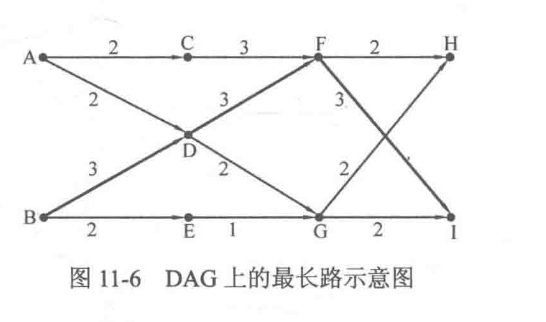

## DAG最长(短)路
且在10.7.3节中已经讨论了如何求解DAG 中的最长路，也就是所谓的“关键路径”。但是求解关键路径的做法对初学者来说确实有些复杂，而 DAG 上的最长路或者最短路问题又是特别重要的一类问题，**很多问题都可以转换成求解 DAG上的最长或最短路径问题**，因此有必要介绍一下更简便的方法，也就是使用本节介绍的方法。由于DAG 最长路和最短路的思想是一致的，因此下面以最长路为例。
本节着重解决两个问题:
1. 求整个DAG中的最长路径(即不固定起点跟终点)。
2. 固定终点，求DAG的最长路径。

先讨论第一个问题:给定一个有向无环图，怎样求解整个图的所有路径中权值之和最大的那条。如图11-6所示`B-D-F-I`就是该图的最长路径长度为 9。
针对这个问题，令 **`dp[i]`表示从i号顶点出发能获得的最长路径长度**，这样所有 dp[i]的最大值就是整个DAG的最长路径长度。显然，根据上面的思路，需要按照逆拓扑序列的顺序来求解 dp 数组(想一想，为什么?)。但是有没有不求出逆拓扑序列也能计算 dp 数组的方法呢?当然有，那就是递归。

1. toposort first
```c++
#include <iostream>
#include <vector>
#include <stack>
#include <queue>
using namespace std;
const int MAXN = 101;
struct node{
    int v, w;
    node(int v, int w){
        this->v = v;
        this->w = w;
    }
};
int indegree[MAXN], oudegree[MAXN];
vector<node> graph[MAXN];
int ver_n, edg_n;
int dp[MAXN]; // dp[i] 表示从节点i出发所能够得到的最长路径


void init_graph(){
    cin >> ver_n >> edg_n;
    for(int i=0; i<edg_n; i++){
        int ni, no, ew;
        cin >> ni >> no >> ew;
        graph[ni].push_back(node(no, ew));
        oudegree[ni]++;
        indegree[no]++;
    }
}

void fill_in0(queue<int>& q, bool flgs[]){
    for(int i=0; i<ver_n; i++)
        if(!flgs[i] && indegree[i]==0){
            q.push(i);
            flgs[i] = true;
        }
}
// 拓扑排序得到拓扑序列, 但使用 stack存储, 再一个个的pop, 过程中求解 dp[]
int topo_resolve(){
    stack<int> toposeq;
    queue<int> wrkQ;
    bool having_inqueue[MAXN];
    fill_in0(wrkQ, having_inqueue);
    while(!wrkQ.empty()){
        int rid = wrkQ.front();
        toposeq.push(rid);
        for(node no: graph[rid])
            indegree[no.v]--;
        wrkQ.pop();
        fill_in0(wrkQ, having_inqueue);
    }
    // 接着按照倒序遍历stack, fill the dp[]
    int res = 0;
    while(!toposeq.empty()){
        int rid = toposeq.top();
        int mxl = 0;
        for(node no: graph[rid])    // 遍历所有孩子, 寻找最大 (dp[i]+ew)
            mxl = max(dp[no.v]+no.w, mxl);
        dp[rid] = mxl;
        toposeq.pop();
        res = max(mxl, res);
    }
    return res;
}

int main(){
    init_graph();
    cout << topo_resolve() << endl;
    return 0;
}

/*
9 12
0 2 2
0 3 2
1 3 3
1 4 2
2 5 3
3 5 3
3 6 2
4 6 1
5 7 2
5 8 3
6 7 2
6 8 2

*/
```
2. or use recursive method

```c++

// @FileName:     recursivecp.cpp
// @CreateTime:   2023/04/03 15:45:29
// @Author:       Rainbow River

#include<iostream>
#include<vector>
using namespace std;

struct node{
    int v,w;
    node(int v, int w){
        this->v = v;
        this->w = w;
    }
};
const int MAXN = 101;
vector<node> graph[MAXN];
int ver_n, edg_n;
int dp[MAXN], indeg[MAXN];

void init_graph(){
    cin >> ver_n >> edg_n;
    for(int i=0; i<edg_n; i++){
        int ni, no, ew;
        cin >> ni >> no >> ew;
        graph[ni].push_back(node(no, ew));
        indeg[no]++;
    }
}

int DP(int i){
    if(dp[i] == 0){     // 未求解, 则先求解
        for(node ch: graph[i]){
            dp[i] = max(dp[i], DP(ch.v)+ch.w);
        }
    }
    return dp[i];
}

int main(){
    init_graph();
    for(int i=0; i<ver_n; i++)
        if(indeg[i] == 0)
            DP(i);
    int res = 0;
    for(int i=0; i<ver_n; i++)
        res = max(dp[i], res);
    cout << res << endl;
    return 0;
}
```
至此，都是令 dp[i]表示从i号顶点出发能获得的最长路径长度。那么，如果**令 dp[i]表示以i号顶点结尾能获得的最长路径长度**，又会有什么结果呢?可以想象，只要把求解公式变为`dp[i]=max{dp[j]+lengthj->i}`(相应的求解顺序变为拓扑序)，就可以同样得到最长路径长度，也可以设置 choice 数组求出具体方案但却不能直接得到字典序最小的方案，这是为什么呢?举个很简单的例子，如图11-8所示，如果令dp[i]表示从i号顶点出发能获得的最长路径长度，且 dp[2]和dp[3]已经计算得到，那么计算dp[1]的时候只需要从V和V中选择字典序较小的V2即可;而如果令 dp[i]表示以i号顶点结尾能获得的最长路径长度，且dp[4]和 dp[5]已经计算得到，那么计算 dp[6]时如果选择了字典序较小的V4，则会导致错误的选择结果:理论上应当是V1-V2-V5的字典序最小，可是却选择了V1-V3-V4。显然，**由于字典序的大小总是先根据序列中较前的部分来判断，因此序列中越靠前的顶点，其 dp 值应当越后计算(对一般的序列型动态规划问题也是如此)。**

问题2. 规定了终点T后?
dp[i] 表示从顶点 i 出发到达终点 T 的最长路径长。
```c++
int DP(int i){
    if(vis[i]) return dp[i];    //dp[i]已计算得到
    vis[i]=true;
    for(int j=0; j<n; j++){     //遍历的所有出边
        if(G[i][j] != INF) {
            dp[i] = max(dp[i], DP(j) + G[i][j]);
        }
    }
    return dp[i];
}
```
完整可运行带示例: 
```c++
// @FileName:     criticalwithT.cpp
// @CreateTime:   2023/04/03 16:23:05
// @Author:       Rainbow River

#include<iostream>
#include<vector>
using namespace std;

struct node{
    int v,w;
    node(int v, int w){
        this->v = v;
        this->w = w;
    }
};
const int MAXN = 101;
vector<node> graph[MAXN];
int ver_n, edg_n, T;
int dp[MAXN], indeg[MAXN];

void init_graph(){
    cin >> ver_n >> edg_n >> T;
    for(int i=0; i<edg_n; i++){
        int ni, no, ew;
        cin >> ni >> no >> ew;
        graph[ni].push_back(node(no, ew));
        indeg[no]++;
    }
    // 注意, 将除终点 T 以外的 dp[i] 设置为 -INF, 表示目前节点 i 与 节点T 之间不可达
    for(int i=0; i<ver_n; i++)
        if(i!=T)
            dp[i] = -MAXN;
}

int DP(int i){
    if(dp[i] == -MAXN){     // 未求解, 则先求解
        for(node ch: graph[i]){
            dp[i] = max(dp[i], DP(ch.v)+ch.w);
        }
    }
    return dp[i];
}

int main(){
    init_graph();
    for(int i=0; i<ver_n; i++)
        if(indeg[i] == 0)
            DP(i);
    int res = 0;
    for(int i=0; i<ver_n; i++)
        res = max(dp[i], res);
    cout << res << endl;
    for(int i=0; i<ver_n; i++)
        cout << dp[i] << " ";
    return 0;
}

/*
9 12 7
0 1 3
0 3 2
1 2 4
1 4 1
3 5 5
2 8 3
5 7 6
4 8 5
4 6 2
4 7 4
6 8 3
6 7 1

*/
```