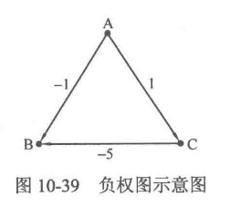
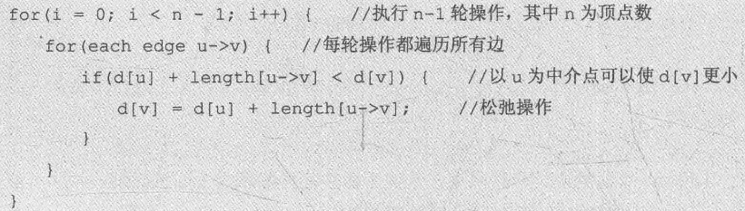
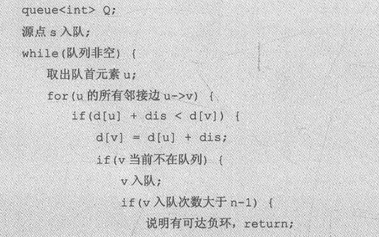

# 最短路径算法
最短路径是图论中一个很经典的问题:**给定图 G(VE)，求一条从起点到终点的路径，使得这条路径上经过的所有边的边权之和最小**。对任意给出的图G(VE)和起点S终点T，如何求从S到T的最短路径. 解决最短路径问题的常用算法有**Diikstra算法, Bellman-Ford算法, SPFA算法, Floyd算法**。
## Diikstra算法
* 使用场景: 解决单源路径最短问题, 给定图G和起点s, 通过算法得到s到其他任一顶点的最短距离

* **基本思想**: 设置一个已访问的节点集合S, 从顶点集V中取出初始顶点s加入S, 从V中选择一个距离s最近的顶点u加入S, 以u为中介松弛初始顶点与其他顶点的距离, 这样的松弛操作执行到V为空.

* 有效性分析: 每次都选与源点最近的节点, 也即在对于s到中介点u的路径已经最优(否则可以重新选择使其最优), 在此基础上, 松弛所有未访问的邻居节点, 选择其中一个节点k, 条件是距离s最短, 这样最优路径就扩张了一个节点, 这样的扩张一直到包含所有的节点.

* 复杂度分析: 空间复杂度O(V+E), V为节点数, E为边数(能使用邻接表就使用邻接表), 同时还有个bool having_access[N]以及mincost[N]以及prevnid[N]。从复杂度来看，主要是外层循环 O(V)与内层循环 (寻找最小的 d]需要 O(V)、举v需要 O(adj[u].size))产生的。又由于对整个程序来说，枚举v的次数总共为 O(adj[u]size)=O(E)，因此总复杂度为 O(V+ E)。可以注意到，上面的做法都是复杂度 O(V)级别的，其中由于必须把每个顶点都标记为已访问，因此外层循环的 O(V)时间是无法避免的，但是寻找最小 du]的过程却可以不必达到O(V)的复杂度，而可以使用堆优化来降低复杂度。最简洁的写法是直接使用 STL 中的优先队列priority_queue，这样使用邻接表实现的 Dikstra算法的时间复杂度可以降为0(VlogV+E)此外，Dijkstra 算法只能应对所有边权都是非负数的情况，如果边权出现负数，那么 Dijkstra算法很可能会出错，这时最好使用SPFA算法。

* 出题策略:于是，碰到这种**有两条及以上可以达到最短距离的路径**，题目就会给出一个第二标尺(第一标尺是距离)，要求在所有选择第二标尺最优的一条路径。而第二标尺常见的是以下三种出题方法或其组合:
(1) 给每条边**再增加一个边权**(比如说花费)，然后要求在最短路径有多条时要求路径上的花费之和最小(如果边权是其他含义，也可以是最大)。
(2) **给每个点增加一个点权**(例如每个城市能收集到的物资)，然后在最短路径有多条时要求路径上的点权之和最大(如果点权是其他含义的话也可以是最小)。
(3) **直接问有多少条最短路径**
对这三种出题方法，都只需要增加一个数组 **opt_sel[]** 来存放新增的边权或点权或最短路径条数，然后在 Dikstra算法中修改优化opt_sel[]的那个步即可，其他部分不需要改动。

注意, 对于最短路径下一节点的选择, 这是不必改变的, 在更新下一节点同时更新新增的数组即可, 需要考虑的是在`(opt_path[j] == opt_path[p] + graph[p][j])`注意更新新增数组, 例如对于第二边权(花费), 若经过节点p使得花费更小, 那么就更新第二边权(累积数组).

### 最短路径的最优子结构
通过对dijkstra算法及以上3个变种思想方法的学习, 可以发现, 他们都满足最优子结构, 也即, 如果当前节点最优, 那么路径上的每一个节点也都是最优, 换句话说, 在当前节点最优时, 对于当前节点的所有邻居节点, 一句题意就可以直接选出下一个最优节点, 此时相对于下一个最优节点, 当前节点就是他路径上的节点, 并且是最优的，简单说来, 以上三种情况都存在和、累计的概念。当面对更复杂的、不满足最优子结构的问题时, 就需要一种更通用的方法求解。

思想很简单, 就是试图使用一种方法, 寻找并保存所有的最短路径, 保存之后什么问题就都没问题了，这种方法就是 **Dijkstra+DFS** 。将前面的前驱节点数组扩展到可包含多前驱的情况: `vector<int> pre[MAXN]`. 此时, dijkstra 专心寻找最短路径, 当接入节点p可以使路径更优, 则清空原前驱vector并加入p(这是由于p相对于原来所有的前驱都更优), 而如果与已有最优情况相同时, 那就加入他们(你们都是我的翅膀). 这样以后, dfs负责遍历pre数组, 递归每一条最短路径, 依据第二标尺更新最优值.
## Bellman-Ford算法
Dijkstra算法可以很好地解决无负权图的最短路径问题，但如果出现了**负权边，Dijkstra 算法就会失效**，例如图10-39中设置A为源点时，首先会将点B和点C的dist值变为-1和1，接着由于点B的dist 值最小，因此用点 B去更新其未访问的邻接点(虽然并没有)。在这之后点B标记为已访问，于是将无法被从点C出发的边CB更新，因此最后distB]就是-1，但显然A到B的最短路径长度应当是A一C-B的-4。

现在考虑环，也就是从某个顶点出发、经过若干个不同的顶点之后可以回到该顶点的情况。而根据环中边的边权之和的正负，可以将环分为零环、正环、负环。显然，图中的零环和正环不会影响最短路径的求解，因为零环和正环的存在不能使最短路径更短:而**如果图中有负环，且从源点可以到达，那么就会影响最短路径的求解**:但如果图中的负环无法从源点出发到达，则最短路径的求解不会受到影响。

如下即为BF算法的伪码, 进行n-1轮松弛, 每一轮松弛所有边:

此时，如果图中没有从源点可达的负环，那么数组d中的所有值都应当已经达到最优。因此只需要再对所有边进行一轮操作，**判断是否有某条边(u,v)仍然满足`d[u]+W(u,v)<d[v]`**，如果有，则说明图中有从源点可达的负环，返回false; 否则说明数组d中的所有值都已经达到最优，返回true。
### BF算法正确性证明
那么，为什么Bellman-Ford 算法是正确的呢?想要了解完整数学证明的读者可以参考算法导论，下面给出一个简洁直观的证明。
首先，如果最短路径存在，那么最短路径上的顶点个数肯定不会超过V个(想一想为什么?)。于是，**如果把源点s作为一棵树的根结点，把其他结点按照最短路径的结点顺序连接就会生成一棵最短路径树**。显然，在最短路径树中，从源点S 到达其余各顶点的路径就是原图中对应的最短路径，且**图和源点一旦确定，最短路径树也就确定了**。另外，由于最短路径上的顶点个数不超过V个，因此最短路径树的层数一定不超过V。由于初始状态下d[s]为0，因此在接下来的步骤中 d[s]不会被改变(也就是说，最短路径树中第一层结点的d值被确定)。接着通过 Bellman-Ford算法的第一轮操作之后，最短路径树中的第二层顶点的d值也会被确定下来;然后进行第二轮操作，于是第三层顶点的d 值也被确定下来。这样计算直到最后一层顶点的d值确定。**由于最短路径树的层数不超过V层因此Bellman-Ford算法的松驰操作不会超过V-1轮**。证毕。请读者使用Bellman-Ford算法重新对[PATA1003]题进行编码，以熟悉Bellman-Ford算法及体会上面给出的思路。

## SPFA算法
虽然Bellman-Ford算法的思路很简洁，但是O(VE)的时间复杂度确实很高，在很多情况下并不尽如人意。仔细思考后会发现，Bellman-Ford 算法的每轮操作都需要操作所有边，显然这其中会有大量无意义的操作，严重影响了算法的性能。于是注意到，只有当某个顶点 u的`d[u]`值改变时，从它出发的边的邻接点V的 `d[v]`值才有可能被改变。由此可以进行一个优化:**建立一个队列**，每次将队首顶点u 取出，然后对从u出发的所有边uv 进行松弛操作,也就是判断 `d[u] +length[u->v]<d[v]`是否成立，如果成立，则用`d[u]+length[u->v]`覆盖`d[v]`,于是 `d[v]`获得更优的值，此时**如果不在队列中**，就把加入队列。**这样操作直到队列为空说明图中没有从源点可达的负环)，或是某个顶点的入队次数超过V-1(说明图中存在从源点可达的负环)。**

这种优化后的算法被称为SPFA(Shortest Path Faster Algorithm)，**它的期望时间复杂度是O(kE)，其中E是图的边数，k 是一个常数，在很多情况下k 不超过 2，可见这个算法在大部分数据时异常高效，并且经常性地优于堆优化的 Diikstra 算法。** 但如果图中有从源点可达的负环，传统 SPFA的时间复杂度就会退化成 O(VE)。

SPFA 十分灵活，其内部的写法可以根据具体场景的不同进行调整。例如上面代码中的FIFO队列可以替换成优先队列(priority_queue)，以加快速度;或者替换成双端队列(deque),使用SLF 优化和 LLL 优化，以使效率提高至少50%。**除此之外，上面给出的代码是 SPFA的BFS 版本，如果将队列替换成栈，则可以实现 DFS 版本的 SPFA，对判环有奇效**对这些内容有兴趣的读者可以去查找资料学习。
最后，请读者使用SPFA算法完成10.4.1节中的几个例题(也就是 Dkstra算法中的例题)以熟练使用SPFA算法。

## Floyd算法

