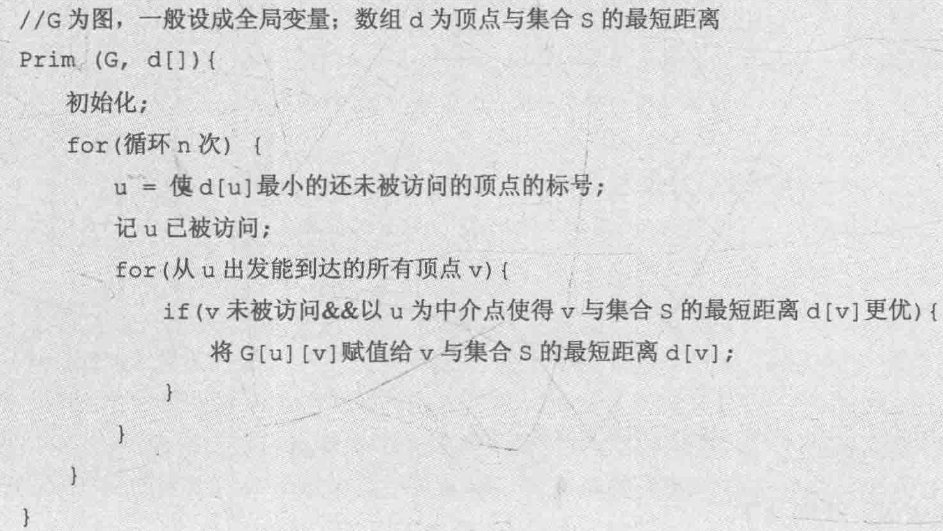
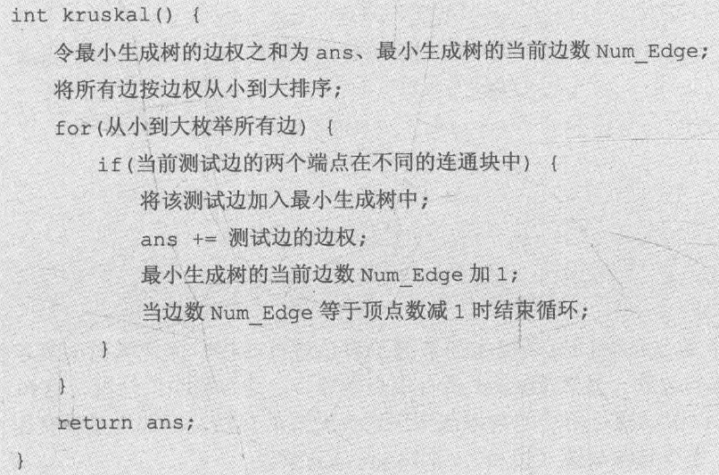

最小生成树有3个性质需要掌握:
* 最小生成树是树，因此其边数等于顶点数减1，且树内一定不会有环。
* 对给定的图G(V, E)，其最小生成树可以不唯一，但其边权之和一定是唯一的。
* 由于最小生成树是在无向图上生成的，因此其根结点可以是这棵树上的任意一个结点。于是，如果题目中涉及最小生成树本身的输出，为了让最小生成树唯一，一般都会直接给出根结点，读者只需以给出的结点作为根结点来求解最小生成树即可。

求解最小生成树一般有两种算法，即prim算法与kruskal算法。这两个算法都是采用了贪心法的思想，只是贪心的策略不太一样。

## prim 算法
prim 算法(读者可以将其读作“普里姆算法”)用来解决最小生成树问题，其基本思想是对图G(V, E)设置集合S，存放已被访问的顶点，然后每次从集合V-S 中选择与集合S的最短距离最小的一个顶点(记为 u)，访问并加入集合 S。
之后，令顶点u 为中介点，优化所有从u能到达的顶点v与集合S之间的最短距离。
这样的操作执行n次(为顶点个数)，直到集合S已包含所有顶点。可以发现，prim 算法的思想与最短路径中 Dijkstra 算法的思想几乎完全相同，只是在涉及最短距离时使用了集合S代替 Diikstra 算法中的起点s。


```c++
// @FileName:     prim.cpp
// @CreateTime:   2023/03/27 21:07:35
// @Author:       Rainbow River

#include <iostream>
#include <vector>

using namespace std;
// 例如给一张邻接表图, 求最小生成树边权
struct node{
    int v, w;
    node(int v, int w){
        this->v = v;
        this->w = w;
    }
};

const int MAXN = 101;
bool having_visited[MAXN];  // 已访问节点数组, S
int min_dist[MAXN];         // 存放节点到集合 S 的最短距离
vector<node> graph[MAXN];
int ver_n, adj_n, st_v = 0; // 顶点数, 边数, 假定生成树从节点0开始


void init_graph(){
    cin >> ver_n >> adj_n;
    for (int i=0; i<adj_n; i++){
        int s, e, w;
        cin >> s >> e >> w;
        graph[s].push_back(node(e, w));
        graph[e].push_back(node(s, w));
    }
    for(int i=0; i<ver_n; i++)
        min_dist[i] = MAXN;     // 起始时所有节点均不可达
}

int pick_v(){
    // pick 一个未访问的距离集合 S 最近的 节点 v
    int v, md = MAXN;
    for(int i=0; i<ver_n; i++){
        if(!having_visited[i] && min_dist[i] < md){
            md = min_dist[i];
            v = i;
        }
    }
    return v;
}

int prim(){
    having_visited[st_v] = true; // 将起始节点加入访问集合
    min_dist[st_v] = 0;
    for(node nd: graph[st_v]){// 初始化起始节点的邻居
        min_dist[nd.v] = nd.w;
    }
    // 函数返回最小生成树的边权
    int tree_w = 0;
    for(int i=0; i<ver_n-1; i++){   // 剩余 n-1 个节点依次收敛
        int v = pick_v();
        tree_w += min_dist[v];
        having_visited[v] = true;
        // 松弛节点 v 的邻居
        for(node nd: graph[v]){
            if(min_dist[nd.v] > nd.w)
                min_dist[nd.v] = nd.w;
        }
    }
    return tree_w;
}

int main(){
    init_graph();
    cout << prim() << endl;
    return 0;
}

/*
5 9
0 1 3
0 2 1
0 3 6
1 2 1
1 3 3
1 4 1
2 3 2
2 4 4
3 4 1
*/

/*
6 10
0 1 4
0 4 1
0 5 2
1 2 6
1 5 3
2 3 6
2 5 5
3 4 4
3 5 5
4 5 3
*/
```
## kruscal 算法
kruskal 算法(读者可以将其读作“克鲁斯卡尔算法”)同样是解决最小生成树问题的-个算法。
和 prim 算法不同，kruskal算法采用了边贪心的策略，其思想极其简洁，理解难度比prim算法要低很多。
kruskal算法的基本思想为: 在初始状态时隐去图中的所有边，这样图中每个顶点都自成一个连通块。
之后执行下面的步骤:
1 对所有边按边权从小到大进行排序。
2 按边权从小到大测试所有边，如果当前测试边所连接的两个顶点不在同一个连通块中，则把这条测试边加入当前最小生成树中; 否则，将边舍弃。
3 执行步骤2，直到最小生成树中的边数等于总顶点数减1或是测试完所有边时结束. 而当结束时如果最小生成树的边数小于总顶点数减1，说明该图不连通。


在这个伪代码里有两个细节似乎不太直观，即 如何判断测试边的两个端点是否在不同的连通块中, 如何将测试边加入最小生成树中。事实上，对这两个问题，可以换一个角度来想。如果把每个连通块当作一个集合，那么就可以把问题转换为判断两个端点是否在同一个集合中，而这个问题在前面讨论过 —— 对，就是并查集。并查集可以通过查询两个结点所在集合的根结点是否相同来判断它们是否在同一个集合，而合并功能恰好可以把上面提到的第二个细节解决，即只要把测试边的两个端点所在集合合并，就能达到将边加入最小生成树的效果。

可以看到，kruskal 算法的时间复杂度主要来源于对边进行排序，因此其时间复杂度是O(ElogE)，其中 E为图的边数。显然 kruskal 适合顶点数较多、边数较少的情况，这和 prim算法恰好相反。于是可以根据题目所给的数据范围来选择合适的算法，即如果是密图(边多)，则用prim算法; 如果是稀疏图(边少)，则用kruskal算法。另外，一定会有读者疑惑，使用 kruskal算法能否保证最后一定能形成一棵连通的树?这个问题的前提是必须在连通图下讨论，如果图本身不连通，那么一定无法形成一棵完整的最小生成树。而对问题本身的讨论则需要分3个部分:
1. 由于图本身连通，因此每个顶点都会有边连接。而一开始每个结点都视为一个连通块因此在枚举过程中一定可以把每个顶点都访问到，且只要是第一次访问某个顶点，对应的边一定会被加入最小生成树中，故图中的所有顶点最后都会被加入最小生成树中。
2. 由于只有当测试边连接的两个顶点在不同的连通块中时才将其加入最小生成树，因此一定不会产生环。而如果有两个连通块未被连接，要么它们本身就无法被连接(也就是非连通图)，要么它们之间一定有边。由于所有边都会被测试，因此两个连通块最终一定会被连接在一起。故最后一定会生成一个连通的结构。
3. 由于算法要求当最小生成树中的边数等于总顶点数减1时结束，因此由连通、边数等于顶点数减1这两点可以确定，最后一定能生成一棵树。

```c++
// @FileName:     kruscal.cpp
// @CreateTime:   2023/03/27 22:09:52
// @Author:       Rainbow River

#include <iostream>
#include <algorithm>
using namespace std;
// 这里图的存储完全基于边
struct node{
    int u, v;
    int cost;
};
const int MAXN = 101;
int ver_n, adj_n;
node egdes[MAXN];
int father[MAXN];
bool cmp(node a, node b);
void init_graph();
int kruscal();
int acq_root(int nid);
bool merge_root(int nid1, int nid2);

// 表示将边表 按权重的升序排序
bool cmp(node a, node b){
    return a.cost < b.cost;
}

void init_graph(){
    cin >> ver_n >> adj_n;
    for(int i=0; i<adj_n; i++)
        cin >> egdes[i].u >> egdes[i].v >> egdes[i].cost;
    sort(egdes, egdes+adj_n, cmp);
    // 初始化并查集
    for(int i=0; i<ver_n; i++)
        father[i] = i;
}

// 并查集操作: 查找--也即获取集合根节点
int acq_root(int nid){
    int tmp = nid;
    while(nid != father[nid])
        nid = father[nid];
    // 此时 nid 就是集合 root, 为优化查找, 
    // 这里可以把查找路径上的节点的 father 均修改为 nid
    while (tmp != father[tmp]) {
        int x = tmp;
        tmp = father[tmp];
        father[x] = nid;
    }
    return nid;
}
// 并查集操作: 合并两个节点所在集合, 指明合并是否成功
bool merge_root(int nid1, int nid2){
    int rt1 = acq_root(nid1), rt2 = acq_root(nid2);
    if(rt1 == rt2) return false;
    else{
        father[rt1] = rt2;
        return true;
    }
}

int kruscal(){
    // 不断地将边的两端点所在集合进行合并, 除非两端点在一个集合
    int res = 0, t_edge_n = 0;
    for(int i=0; i<adj_n; i++){ // 从小到大枚举边
        if(merge_root(egdes[i].u, egdes[i].v)){
            res += egdes[i].cost;
            t_edge_n++;
        }
        if(t_edge_n == ver_n-1)break;
    }
    return res;
}

int main(){
    init_graph();
    cout << kruscal() << endl;
    return 0;
}
```