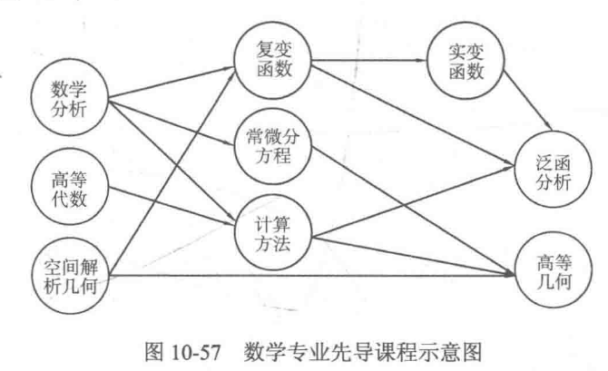
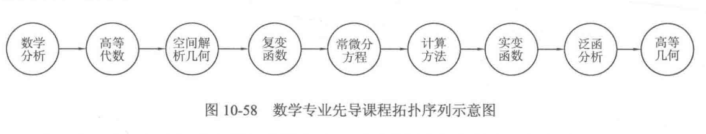

## 1. DAG 有向无环图
如果一个有向图的任意顶点都无法通过一些有向边回到自身，那么称这个有向图为有向无环图(DirectedAcyclic Graph，DAG)。


## 2. 拓扑排序
拓扑排序是将有向无环图G的所有顶点排成一个线性序列，使得对图G中的任意两个顶点u、V，如果存在边u->v，那么在序列中u一定在前面。这个序列又被称为拓扑序列。同时还会发现，如果两门课程之间没有直接或间接的先导关系，那么这两门学习的先后顺序是任意的(例如“复变函数”与“计算方法”的学习顺序就是任意的)。于是可以把上面的课程排成一个学习的先后序列，使得这个序列中的课程顺序满足图 10-57 的先导课程顺序,如图10-58所示。



拓扑排序步骤:
1. 定义一个队列Q，并把所有入度为0的结点加入队列。
2. 取队首结点，输出。然后删去所有从它出发的边，并令这些边到达的顶点的入度减1, 如果某个顶点的入度减为 0，则将其加入队列。
3. 反复进行操作，直到队列为空。如果队列为空时入过队的结点数目恰好为 N，说明拓扑排序成功，图G为有向无环图:否则，拓扑排序失败，图G中有环。

```c++
// @FileName:     toposort.cpp
// @CreateTime:   2023/03/28 10:42:57
// @Author:       Rainbow River
/*
拓扑排序完整程序示例: 它输出一个拓扑排序序列, 若不存在, 则打印
错误提示
*/
#include <iostream>
#include <queue>
#include <vector>

using namespace std;
const int MAXN = 101;
struct node{
    int v, w;
    node(int v, int w){
        this->v = v;
        this->w = w;
    }
};
vector<node> graph[MAXN];
int in_deg[MAXN];   // 入度表
int ver_n, adj_n;   // 顶点数, 边数
vector<int> topo_seq; // 拓扑序列

void init_graph(){
    cin >> ver_n >> adj_n;
    for(int i=0; i<adj_n; i++){
        int v0, v1;
        cin >> v0 >> v1;
        graph[v0].push_back(node(v1, 0));   // the weight info is useless here
        in_deg[v1]++;   // 更新入度
    }
}

bool topology_sort(){
    queue<int> wrkq;
    // 将所有入度为0的节点加入 wrkq
    for(int i=0; i<ver_n; i++)
        if(in_deg[i] == 0)
            wrkq.push(i);
    while (!wrkq.empty()){
        int rt = wrkq.front();
        for(node nd: graph[rt]){
            if(--in_deg[nd.v]==0)     // 遍历 rt 指向节点, 将它们的入度减1
                wrkq.push(nd.v);    // 若为0加入队列
        }
        wrkq.pop();
        topo_seq.push_back(rt);
    }
    return topo_seq.size() == ver_n;
}

int main(){
    init_graph();
    bool sort_ok = topology_sort();
    if(sort_ok){
        for(int nid: topo_seq)
            cout << nid << " ";
        cout << endl;
    }else{
        cout << "It's not a DAG, so doesn't have topo-seq." << endl;
    }
}
/*
negtive example:
5 7
0 1
0 2
1 2
3 0
3 2
1 4
4 3
*//*
positive example:
5 8
0 1
0 2
0 3
3 1
1 4
3 2
2 4
3 4
*/
```

拓扑排序的很重要的应用就是判断一个给定的图是否是有向无环图。正如上面的代码如果 topologicalSort0函数返回 true，则说明拓扑排序成功，给定的图是有向无环图;否则,说明拓扑排序失败，给定的图中有环。

最后指出，如果要求有多个入度为 0的顶点，选择编号最小的顶点，那么把 queue 改成priority queue，并保持队首元素(堆顶元素)是优先队列中最小的元素即可(当然用 set也是可以的)。