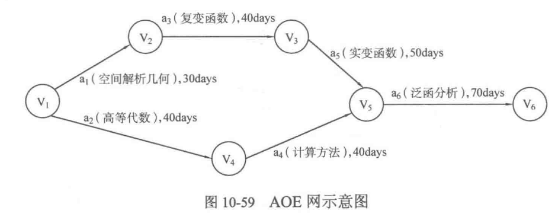
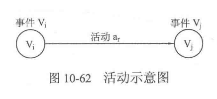
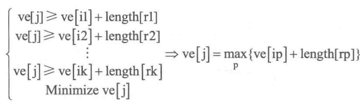
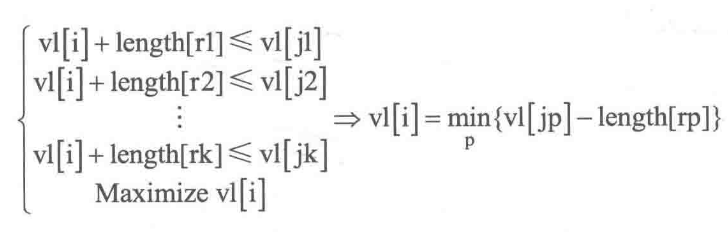

## AOV网 和 AOE网
**顶点活动(Activity On Vertex，AOV)网是指用顶点表示活动，而用边集表示活动间优先关系的有向图**。例如图10-57 的先导课程示意图就是 AOV 网，其中图的顶点表示各项课程也就是“活动”;有向边表示课程的先导关系，也就是“活动间的优先关系”。显然，图中不应当存在有向环，否则会让优先关系出现逻辑错误。

**边活动(Activity On Edge，AE)网是指用带权的边集表示活动，而用顶点表示事件的有向图，其中边权表示完成活动需要的时间。**

例如图10-59 中，边$a_1 ... a_6$表示需要学习的课程，也就是“活动”，边权表示课程学习需要消耗的时间; 顶点$V_1 ... V_6$表示到此刻为止前面的课程已经学完，后面的课程可以开始学习，也就是“事件”(如 V~5~表示a~4~计算方法和a~5~实变函数已经学完，a~6~泛函分析可以开始学习。从另一个角度来看，a~6~只有当a~4~和a~5~都完成时才能开始进行，因此当a~4~计算方法学习完毕后必须等待a~5~实变函数学习完成后才能进入到a~6~泛函分析的学习)，显然“事件”仅代表一个中介状态。


## 最长路径
一般来说，AOE网用来表示一个工程的进行过程，而工程常常可以分为若干个子工程(即“活动”)，显然AOE 网不应当有环，否则会出现和AOV 网一样的逻辑问题(因此可以认为AOV网和AOE网都是有向无环图)。考虑到对工程来说总会有一个起始时刻和结束时刻，因此AOV 网一般只有一个源点(即入度为0的点)和一个汇点(即出度为0的点)。

既然AOE 网是基于工程提出的概念，那么一定有其需要解决的问题。AOE 网需要着重解决两个问题:
    **a.工程起始到终止至少需要多少时间;**
    **b.哪条(些)路径上的活动是影响整个工程进度的关键。**

以图 10-59 为例，由于完成 "a~1~空间解析几何"、"a~3~复变函数"、"a~5~实变函数" 共需要120天，因此在 "a~2~高等代数" 准时完成的前提下，"a~4~计算方法" 可以有40天的弹性时间. 
即只要在第41~81天开始学习 "a~4~计算方法" ，都能赶在 "a~5~实变函数" 完成之前完成，从而进入 "a~6~泛函分析" 的学习。显然，"a~1~空间解析几何"、"a~3~复变函数"、"a~5~实变函数"、"a~6~泛函分析" 这4个活动是最关键的，因为推迟这4个活动中的任何一个的开始时间，都会使整个工程的完成时间变长. **AOE 网中的最长路径被称为关键路径(强调:关键路径就是AOE网的最长路径)，而把关键路径上的活动称为关键活动，显然关键活动会影响整个工程的进度。**

## 关键路径
对一个没有正环的图(指从源点可达的正环，下同)，如果需要求最长路径长度，则可以把所有边的边权乘以-1，令其变为相反数，然后使用 Bellman-Ford 算法或SPFA算法求最短路径长度，将所得结果取反即可。注意:此处不能使用 Diikstra 算法，原因是 Dikstra 算法不能处理负边权的情况，即便原图的边权均为正，乘以-1 之后也会出现负权。

显然，如果图中有正环，那么最长路径是不存在的。但是，如果需要求最长简单路径(也就是每个顶点最多只经过一次的路径)，那么虽然最长简单路径本身存在，却没有办法通过Bellman-Ford 等算法来求解，原因是最长路径问题是NP-Hard 问题(也就是没有多项式时间复杂度算法的问题)。注:最长路径问题，即Longest Path Problem，寻求的是图中的最长简单路径。而如果求的是**有向无环图的最长路径长度，则要讨论的关键路径的求法可以比上面的做法更快**。

### 最早开始时间 和 最迟开始时间
由于AOE网实际上是有向无环图，而关键路径是图中的最长路径，因此本节实际上给出了一种求解有向无环图(DAG)中最长路径的方法。
由于关键活动是那些不允许拖延的活动，因此这些活动的最早开始时间必须等于最迟开始时间(例如 a~4~ 计算方法的最早开始时间是第41天，最迟开始时间是第81天;而 a~5~ 实变函数的最早开始时间和最迟开始时间都是第 71 天)。因此可以设置数组e和1，其中`e[r]`和`l[r]`分别表示活动 a~r~ 的最早开始时间和最迟开始时间。于是，当求出这两个数组之后，就可以通过判断 `e[r]==l[r]` 是否成立来确定活动r是否是关键活动。



如图10-62所示，事件`Vi`在经过活动`ar`之后到达事件`Vj`。注意到顶点作为事件，也有拖延的可能，因此会存在最早发生时间和最迟发生时间。其中事件的最早发生时间可以理解成旧活动的最早结束时间，事件的最迟发生时间可以理解成新活动的最迟开始时间。设置数组 `ve` 和 `vl`，其中 `ve[i]` 和 `vl[i]` 分别表示事件i的最早发生时间和最迟发生时间，然后就可以将求解 `e[r]`和 `l[r]` 转换成求解这两个新的数组:
1. 对活动 `ar` 来说，只要在事件 `Vi` 最早发生时马上开始，就可以使得活动 `ar` 的开始时间最早，因此`e[r]=ve[i]`。
2. 如果 `l[r]` 是活动 `ar` 的最迟发生时间，那么 `l[r] + length[r]` 就是事件`Vj`的最迟发生时间。因此`l[r]=vl[i]-length[r]`。

## ve[], vl[] 求解
可以利用拓扑排序进行求解, 例如 ve[] , 对于节点 i, 需要知道所有前驱的 ve 然后加上活动边的花费, 取其最大者. 观察拓扑排序求解, 发现每次都会选择没有前驱的节点， 因而可以直接求解, 这样再更新指向的所有节点, 即可.


对于 vl[], 设有节点i, 它的所有后继节点的 vl 已知, 则i的vl值就是后继结点减去对应边权的最小值


```C++
// @FileName:     criticalpath.cpp
// @CreateTime:   2023/03/28 16:24:44
// @Author:       Rainbow River

#include<iostream>
#include<iostream>
#include<queue>
#include<stack>

using namespace std;
struct node{
    int v, w;
    node(int v, int w){
        this->v = v;
        this->w = w;
    }
};
const int MAXN = 101;   // 各种意义的上限, 例如边权、顶点数、边数都不超过该值
vector<node> graph[MAXN];   // 邻接表
int ver_n, adj_n;   // 顶点数, 边数
int e[MAXN], l[MAXN], ve[MAXN], vl[MAXN], indeg[MAXN];
stack<int> topo_seq;

void fill(int a[], int n, int val);
void init_graph();
bool topo();
void fill_vl(int vle);
void critical_path();

void fill(int a[], int n, int val){
    for(int i=0; i<n; i++)
        a[i] = val;
}

void init_graph(){
    cin >> ver_n >> adj_n;
    for(int i=0; i<adj_n; i++){
        int v1, v2, w;
        cin >> v1 >> v2 >> w;
        graph[v1].push_back(node(v2, w));
        indeg[v2]++;
    }
}

bool topo(){
    queue<int> wrkq;
    for(int i=0; i<ver_n; i++)
        if(indeg[i] == 0)
            wrkq.push(i);
    while (!wrkq.empty()){
        int rt = wrkq.front();
        for(node nd: graph[rt]){
            if(ve[nd.v] < ve[rt]+nd.w)
                ve[nd.v] = ve[rt]+nd.w; // 更新 邻居事件的 最早发生时间
            if(--indeg[nd.v] == 0)
                wrkq.push(nd.v);
        }
        wrkq.pop();
        topo_seq.push(rt);  // 加入拓扑序列
    }
    return topo_seq.size() == ver_n;
}

// 计算 vl[], vle是 ve[l], l是拓扑排序的最后一位
void fill_vl(int vle){
    fill(vl, ver_n, vle);
    while (!topo_seq.empty()){
        int v = topo_seq.top();
        for(node nd: graph[v]){
            if(vl[nd.v]-nd.w < vl[v]){
                vl[v] = vl[nd.v]-nd.w;
            }
        }
        topo_seq.pop();
    }
    
}

// critical path solution
void critical_path(){
    for(int i=0; i<ver_n; i++){
        for(node nd: graph[i]){
            // 活动边 (i, nd.v) 最早开始时间也即是 始点事件i 的最早发生时间
            // 活动边 (i, nd.v) 最迟开始时间也即是 终点事件i 的最迟发生时间减去活动时间
            if(ve[i] == vl[nd.v]-nd.w){
                cout<<i<<" -> "<<nd.v<<" ("<<nd.w<<")"<<endl;
            }
        }
    }
}


int main(){
    init_graph();               // 数据输入
    topo();                     // 获取拓扑序列同时求解 ve[]
    fill_vl(ve[ver_n-1]);       // 求解 vl[]
    critical_path();            // 输出关键活动
    cout << "Total time is " << ve[ver_n-1] <<" at least."<< endl;
    return 0;
}

/*
5 8
0 1 6
0 2 4
0 3 3
3 1 4
1 4 5
3 2 2
2 4 7
3 4 8
*/
```
## 结语
即便图中有**多条关键路径**，但如果只要求输出关键活动，按上面的写法已经可以了。如果要完整输出所有关键路径，就需要把关键活动存下来，方法就是**新建一个邻接表，当确定边 u->v 是关键活动时，将边u - v加入邻接表**。这样最后生成的邻接表就是所有关键路径合成的图了，可以用DFS 遍历来获取所有关键路径(具体实现就留给读者完成吧)。最后指出，**使用动态规划的做法可以让读者能更简洁地求解关键路径**(具体做法参见11.6节)。
